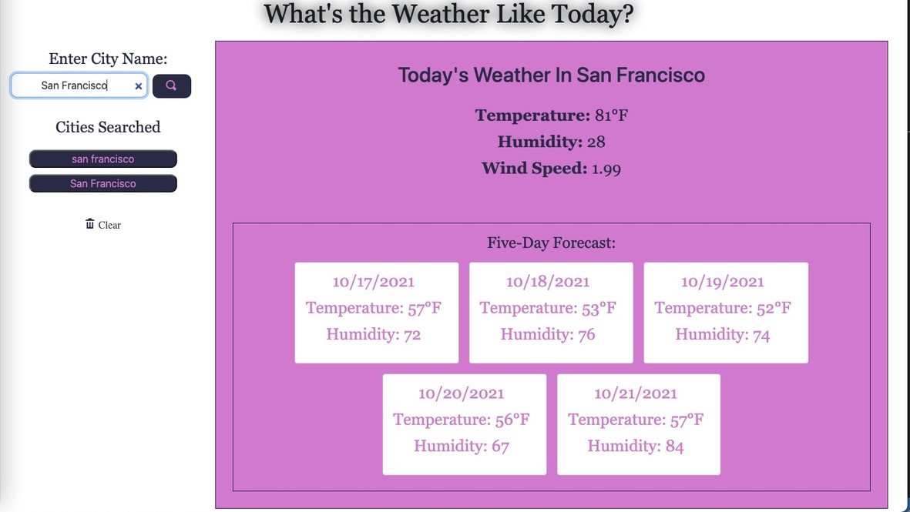

## Hey, What's the Weather Like Today?
&nbsp;  

## Description 

This application is a weather dashboard which forecasts the current weather in the city you search, and a five day forecast thereafter using an OpenWeather One Call API, which retrieves the weather data for cities. The weather dashboard is built with a third-party API, an updated HTML and CSS which allows the user to access the data they need and work with a functional website. 

&nbsp;  

## Tools 
* jQuery
* OpenWeather One Call API
* HTML
* CSS
* JavaScript

&nbsp;  

## Screenshot

&nbsp;  

## Live Website

&nbsp;  

## Thank You
Please feel free to contact me with any additional questions: 
* GITHUB: https://www.github.com/winterkanda
* EMAIL: <mailto: kirankanda06@gmail.com>
### @2021 Winter
